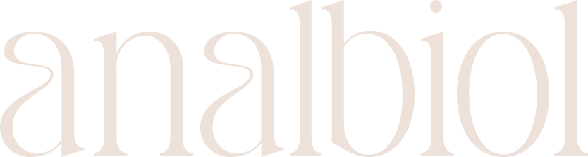
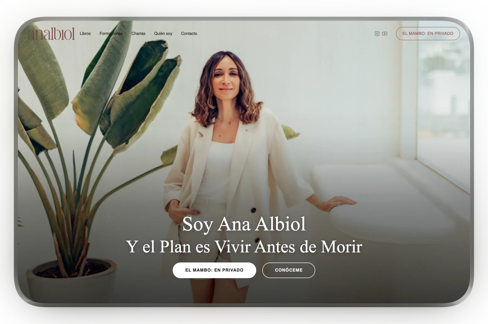

  

 

# Ana Albiol — Web Oficial

**Diseño y desarrollo web para la marca personal de Ana Albiol**, escritora, formadora y conferenciante bajo el lema *"Vivir antes de morir"*. Un sitio estático de alto rendimiento construido con un enfoque en la identidad visual, la calidad emocional del contenido y la escalabilidad técnica.

 

 

  
  
  
  
  
  
  

---

## El Proyecto

Ana Albiol necesitaba una presencia digital que reflejara la profundidad y autenticidad de su marca personal. El resultado es un sitio tranquilo, minimalista y sin distracciones — diseñado para generar confianza y comunicar desde la verdad, no desde el marketing de cursos.

La paleta se limita a dos colores: **Marsala** (`#964F4C`) y **Vainilla** (`#F6F1EB`). Cada decisión de diseño —tipografía, espaciado, animaciones— sirve a esa intención.

---

## Lo que hace especial este proyecto

- **Rendimiento extremo** — Astro genera HTML estático puro. Sin frameworks pesados en producción, sin JavaScript innecesario. Ideal para un Lighthouse score casi perfecto.
- **Island Architecture** — Solo los componentes que necesitan interactividad (Header, Hero, Cookie Banner) se hidratan en el cliente. El resto es HTML estático limpio.
- **SEO de base** — Sitemap automático, meta tags Open Graph, robots.txt y estructura semántica desde el primer día.
- **Cumplimiento GDPR** — Banner de cookies funcional, páginas de aviso legal, política de privacidad y cookies incluidas.
- **Animaciones de intención** — Motion se usa con criterio: preloader, transiciones de entrada, parallax sutil. Nunca distrae, siempre aporta.
- **Despliegue listo para producción** — Multi-stage Dockerfile que compila los estáticos y los sirve con Nginx. Un solo comando para subir a cualquier VPS.
- **Design System propio** — Variables CSS centralizadas, tipografía como protagonista, y una página `/design-system` para validar la identidad visual de la marca.

---

## Páginas del Sitio

- `/` — Home con Hero animado y propuesta de valor
- `/quien-soy` — Historia y misión de Ana
- `/libros` — Catálogo de publicaciones
- `/formaciones` — Programas y talleres
- `/charlas` — Conferencias y eventos
- `/en-privado` — Mentoría individual
- `/contacto` — Formulario de contacto
- `/design-system` — Sistema de diseño interno

---

## Diseño y Desarrollo

 

**Jesús David** — Diseñador y Desarrollador Web

Especializado en webs de marca personal con foco en rendimiento, diseño emocional y arquitecturas modernas con Astro y Svelte.

---

*Todos los derechos sobre el contenido y la marca pertenecen a Ana Albiol.*
